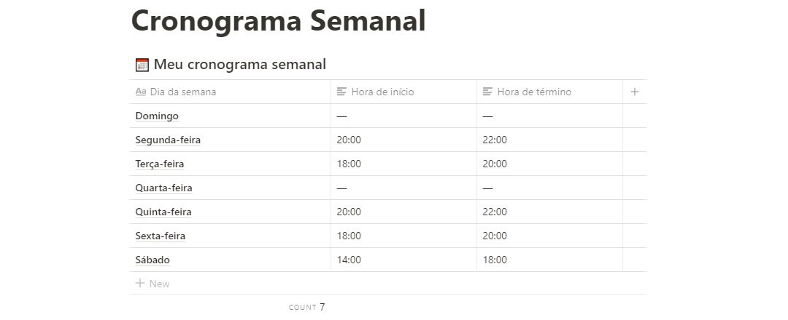
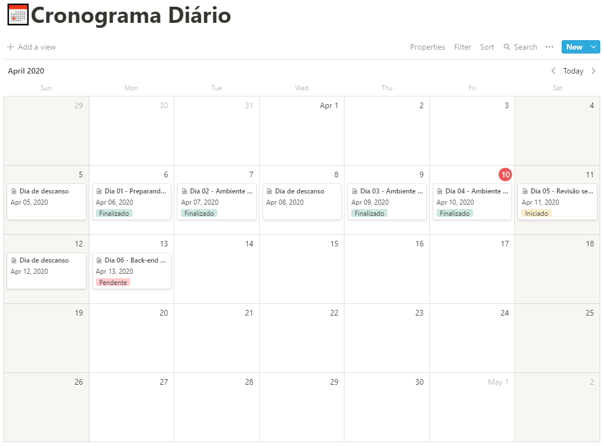

# Desafio 01 - Planejando meus estudos

Nesse desafio, você deve planejar os seus estudos.

Para isso, você deve criar um cronograma que irá se adaptar ao seu tempo e ritmo.

Defina qual será seu horário de estudo, criando tarefas que estarão atreladas a um calendário, para se manter com foco e sempre alinhado com seus objetivos!

## Definindo o cronograma semanal

Cronograma semanal com os horários fixos de estudo durante minha jornada no bootcamp.

## Definindo o cronograma diário

Cronograma com o conteúdo e com as tarefas diárias que irei consumir durante as semanas do bootcamp.

---

**Created by** `costaruan`
